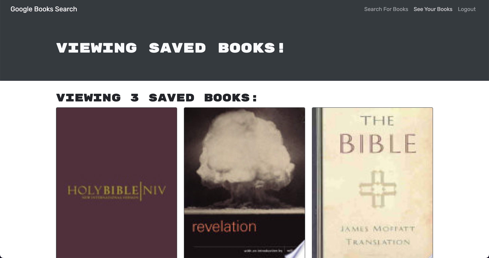

# Book Search Engine Starter Code

## Description

A fully functioning Google Books API search engine originally built with a RESTful API, and refactored to be a GraphQL API built with Apollo Server. The app was built using the MERN stack, with a React front end, MongoDB database, and Node.js/Express.js server and API.

## Live URL

Link to [Heroku](https://morning-gorge-83743.herokuapp.com/)

## Usage

In order to use this, you will need Node.js and MongoDB installed

Make sure your local mongo database connection is up and running then go to the root directory and open up the terminal, then type `npm install` to install, this will install **concurrently**. Afterwards type `npm run install` which will install the dependencies in the package.json files in both the client and the server folders. Lastly type the code `npm run develop` to start the servers

Your default web browser should open on its own but if it doesn't, open up the browser of your choice and type `localhost:3000` as the url, this will be open up the application for you to use.

To use it, start by clicking on the login/signup button and create an account (_or log in if you've already created an account_), afterwards, in the search bar, type the name of the book you want a list of books should show up, click on the **Save this Book!** button to save it to your account.

Now, on the top right, click on the **See Your Books** link to view the books you have saved, you can delete them from there if you'd like

If you'd like to play with the api, you can go to `localhost:3001/graphql` and try it out from there

## License

This application is not covered under any license

## Technologies

The technologies used were, React, Apollo, GraphQL, Node.js, HTML, CSS, Javascript

## Contributions

By Daniel Arzanipour

## Questions

[My Github](https://github.com/DanielArzani)

If you need to reach me for any additional questions, you can reach me at my [Gmail](mailto:daniel.arzanipour@gmail.com)
